# tabuada

Treino de tabuada até 12×12 no terminal, com relatório de cada sessão e histórico de evolução. Também abre no navegador com a mesma interface.

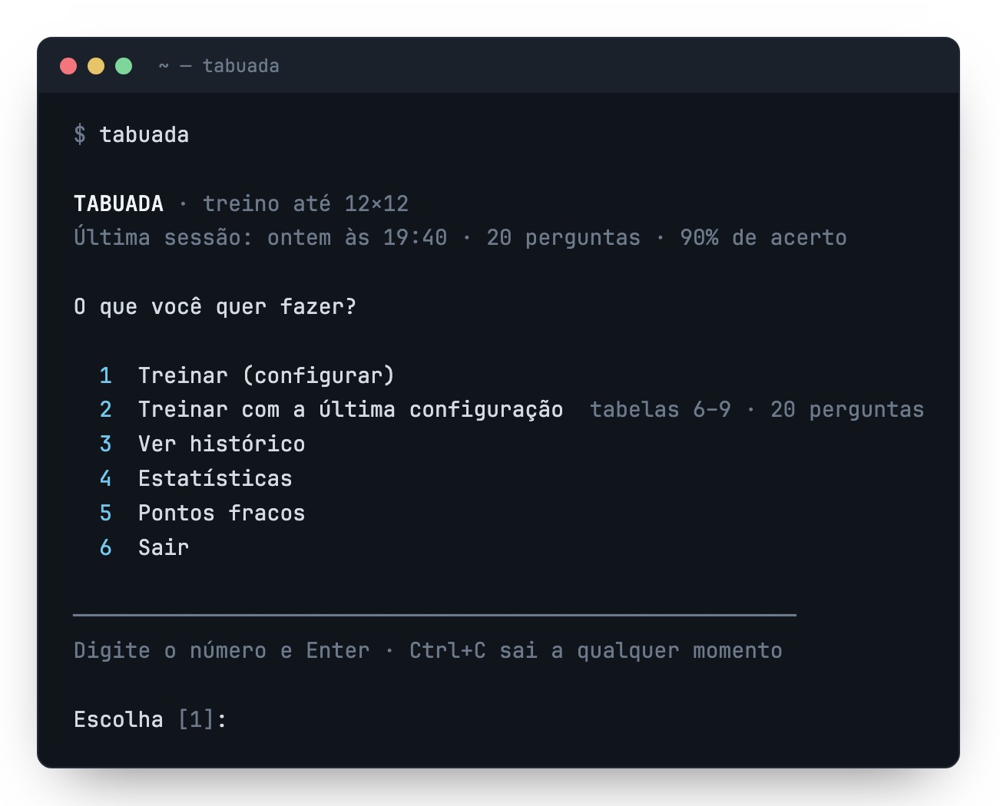

- **Mede o tempo de cada resposta**, para mostrar as contas que você acerta mas ainda demora.
- **Acertar rápido vale mais que acertar pensando:** até 2 s é automático, de 2 a 4 s você hesitou, acima de 4 s teve que pensar.
- **Repetição espaçada:** conta errada volta 3 a 5 perguntas depois, conta que você pensou para acertar volta mais tarde, e a automática quase não se repete. Com **`--foco`**, cada conta volta no dia em que está na hora de revisar.
- **Dois jeitos de usar:** um menu que guia passo a passo, para quem nunca usou terminal, e comandos diretos para quem já sabe o que quer.
- Funciona em **macOS, Linux e Windows**. Precisa só do Python 3.8 ou mais novo, sem nenhuma outra dependência.

## Sumário

- [Instalação](#instalação)
  - [Windows](#windows)
  - [macOS](#macos)
  - [Linux](#linux)
  - [Sem instalar](#sem-instalar)
- [Primeiro treino, passo a passo](#primeiro-treino-passo-a-passo)
- [Durante a sessão](#durante-a-sessão)
- [Relatório](#relatório)
- [Histórico, estatísticas e pontos fracos](#histórico-estatísticas-e-pontos-fracos)
- [Como o tabuada decide o que repetir](#como-o-tabuada-decide-o-que-repetir)
- [Comandos](#comandos)
- [No navegador](#no-navegador)
- [Aparência no terminal](#aparência-no-terminal)
- [Onde ficam os dados](#onde-ficam-os-dados)
- [Atualizar e desinstalar](#atualizar-e-desinstalar)
- [Problemas comuns](#problemas-comuns)
- [Desenvolvimento](#desenvolvimento)
- [Autor](#autor)

## Instalação

O jeito recomendado é o [pipx](https://pipx.pypa.io), que instala programas Python cada um no seu canto e deixa o comando `tabuada` disponível no terminal. Os passos abaixo instalam o Python (se faltar), o pipx e o tabuada.

O endereço usado na instalação é um `.zip` do GitHub, então **não é preciso ter o Git instalado**.

### Windows

Funciona no Windows 10 e 11. Use o **Windows Terminal** (já vem no Windows 11; no 10, instale pela Microsoft Store) ou o PowerShell.

1. **Instale o Python.** Abra o PowerShell e rode:

   ```powershell
   winget install Python.Python.3.12
   ```

   Ou baixe em [python.org/downloads](https://www.python.org/downloads/). No instalador, **marque a opção "Add python.exe to PATH"** antes de clicar em *Install Now*.

2. **Feche e abra o terminal de novo** e confira:

   ```powershell
   py --version
   ```

3. **Instale o pipx:**

   ```powershell
   py -m pip install --user pipx
   py -m pipx ensurepath
   ```

4. **Feche e abra o terminal de novo** (para ele enxergar o novo PATH) e instale o tabuada:

   ```powershell
   pipx install https://github.com/weslleycabral/tabuada/archive/refs/heads/main.zip
   ```

5. Pronto:

   ```powershell
   tabuada
   ```

> Se o `pipx` não for encontrado no passo 4, use `py -m pipx install ...` no lugar de `pipx install ...`. Se o `tabuada` não for encontrado no passo 5, veja [Problemas comuns](#problemas-comuns).
>
> O tabuada ainda não foi testado num Windows real, só em macOS. Se algo sair estranho, abra uma [issue](https://github.com/weslleycabral/tabuada/issues) com um print da tela.

### macOS

O macOS tem um Python antigo da Apple (o `pip` dele instala o pacote com o nome errado). Use o [Homebrew](https://brew.sh):

1. **Instale o Homebrew**, se ainda não tiver, seguindo as instruções de [brew.sh](https://brew.sh).

2. **Instale o pipx e o tabuada:**

   ```sh
   brew install pipx
   pipx ensurepath
   ```

3. **Feche e abra o Terminal** e rode:

   ```sh
   pipx install https://github.com/weslleycabral/tabuada/archive/refs/heads/main.zip
   tabuada
   ```

Funciona no Terminal do macOS, no iTerm2 e em qualquer outro terminal.

### Linux

Quase toda distribuição já traz o Python 3. Instale o pipx pelo gerenciador de pacotes:

| Distribuição | Comando |
|---|---|
| Ubuntu 23.04+, Debian 12+ | `sudo apt install pipx` |
| Fedora | `sudo dnf install pipx` |
| Arch, Manjaro | `sudo pacman -S python-pipx` |
| openSUSE | `sudo zypper install python3-pipx` |
| Outras / versões antigas | `python3 -m pip install --user pipx` |

Depois:

```sh
pipx ensurepath
# feche e abra o terminal
pipx install https://github.com/weslleycabral/tabuada/archive/refs/heads/main.zip
tabuada
```

### Sem instalar

Dá para rodar direto do código, em qualquer sistema com Python 3.8+:

1. Baixe o código: [main.zip](https://github.com/weslleycabral/tabuada/archive/refs/heads/main.zip) (ou `git clone https://github.com/weslleycabral/tabuada`).
2. Descompacte e abra um terminal dentro da pasta.
3. Rode:

   ```sh
   python3 -m tabuada     # macOS e Linux
   py -m tabuada          # Windows
   ```

Nesse modo, onde este guia diz `tabuada`, use `python3 -m tabuada` (ou `py -m tabuada`).

## Primeiro treino, passo a passo

### 1. Abra o menu

Digite `tabuada` e aperte Enter. O menu mostra um resumo da última sessão e as opções numeradas. Digite o número e Enter; o valor entre colchetes, como `[1]`, é o que vale se você só apertar Enter.


### 2. Configure o treino

A opção **1** abre um assistente com quatro perguntas:

- **Quais tabelas?** `todas`, uma lista (`6,7,8`) ou uma faixa (`2-9`).
- **Como treinar?** Um número fixo de perguntas ou contra-relógio (responder o máximo que der num tempo).
- **Quantas perguntas** (ou quantos segundos).
- **Focar nos pontos fracos?** Com `s`, o sorteio segue a [repetição espaçada](#como-o-tabuada-decide-o-que-repetir): aparecem mais as contas com revisão vencida.

Se você digitar algo inválido, ele explica o formato e pergunta de novo. No fim, mostra o **comando equivalente**, para você pular o menu da próxima vez:

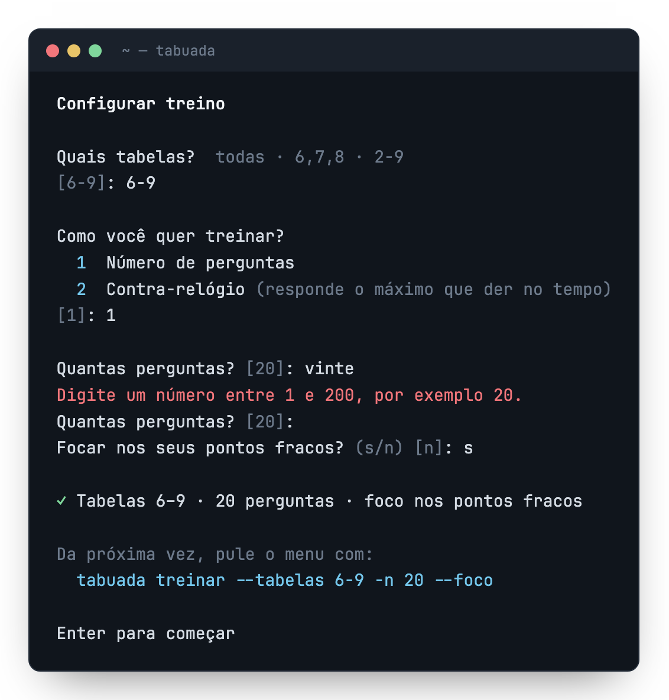

A escolha fica salva: a opção **2** do menu (ou `tabuada treinar`) repete a última configuração.

### 3. Responda

Digite o resultado. **Não precisa apertar Enter** quando:

- a resposta é a certa (`81` em 9 × 9, `9` em 3 × 3), ou
- ela já tem o máximo de dígitos que a conta pode dar: 2 em contas de um dígito por um dígito (9 × 9), 3 em 9 × 12, 4 em 12 × 12. Em 9 × 9, digitar `75` já confere a resposta (errada) e passa para a próxima.

Para uma resposta errada mais curta que isso, aperte Enter. O cabeçalho mostra em que pergunta você está, acertos, erros, pulos e o tempo total. Os atalhos ficam na barra de baixo.

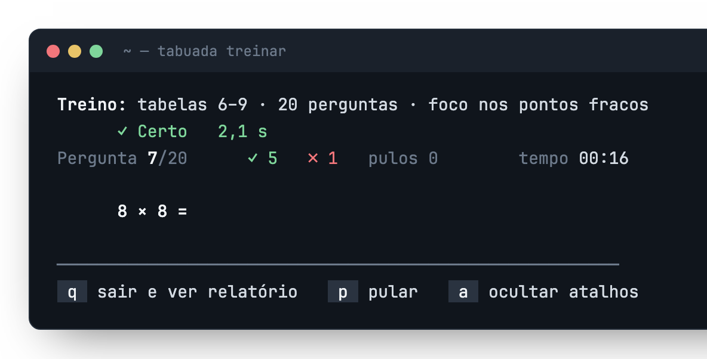

Depois de cada resposta, a linha de cima mostra como foi e quanto tempo levou:

| Acertou, mas demorou | Errou | Pulou |
|---|---|---|
| 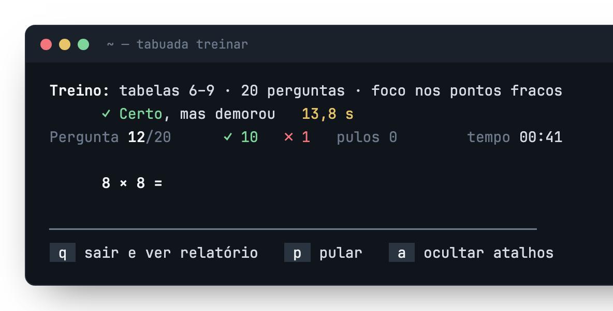 | 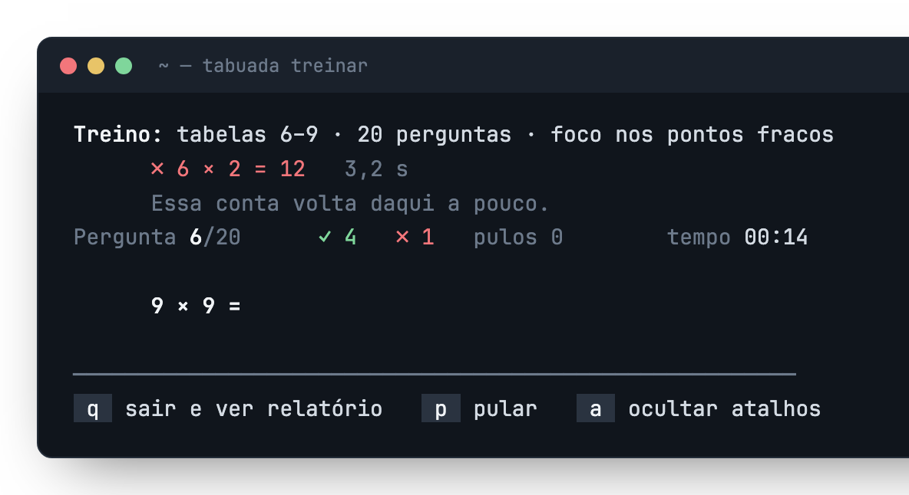 | 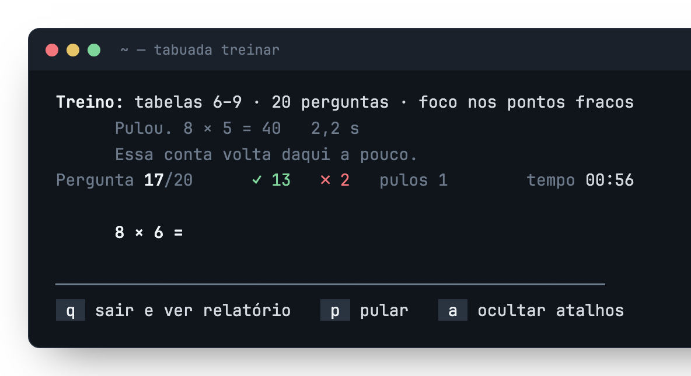 |
| Tempo em amarelo acima de 4 s. A conta volta mais tarde na sessão (6 a 9 perguntas depois). | Mostra a conta certa. Ela volta daqui a 3 a 5 perguntas. | Mostra a resposta. A conta também volta. |

### 4. Veja o relatório

Ao terminar (ou ao sair antes com `q`), aparece o relatório. Veja a seção [Relatório](#relatório).

## Durante a sessão

Os atalhos agem na hora, sem Enter:

| Tecla | O que faz |
|---|---|
| `q` | sai e mostra o relatório do que foi respondido até ali |
| `p` | pula a pergunta (a conta volta mais tarde) |
| `a` | mostra ou esconde a barra de atalhos |
| Ctrl+C | igual a `q` |

Com a barra escondida, fica só a dica `[a] atalhos`. A preferência vale para as próximas sessões, e o tempo gasto apertando `a` não conta na resposta.

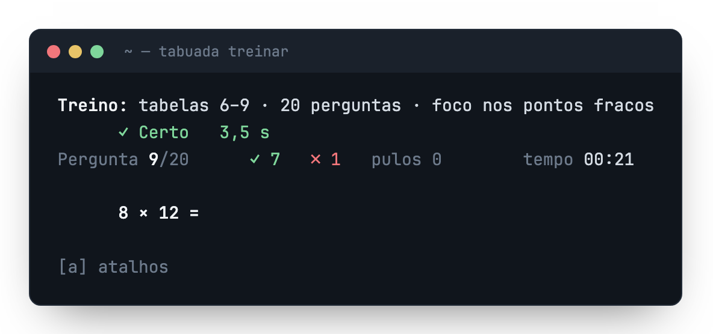

Outras letras são ignoradas e não contam como erro. Backspace apaga o último dígito.

## Relatório

No fim da sessão aparece só o **resumo** e o **próximo passo** recomendado, já com o comando pronto para copiar. O resto fica em grupos que abrem por tecla (digite a letra e Enter):

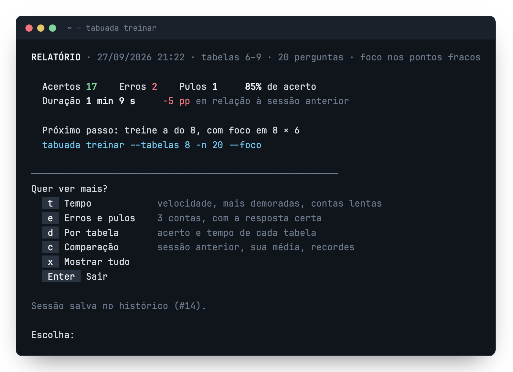

| Tecla | Grupo | O que mostra |
|---|---|---|
| `t` | Tempo | média, mediana, respostas mais demoradas e contas que você sabe mas ainda faz devagar |
| `e` | Erros e pulos | cada conta errada ou pulada, com a resposta certa |
| `d` | Por tabela | acerto e tempo médio de cada tabela, com a mais fraca marcada |
| `c` | Comparação | com a sessão anterior, com a sua média e com o seu recorde |
| `x` | Tudo | abre todos os grupos |
| Enter | | sai |

A mesma tecla fecha o grupo aberto.

<details>
<summary><b>Ver os grupos do relatório</b></summary>

**`t` Tempo**

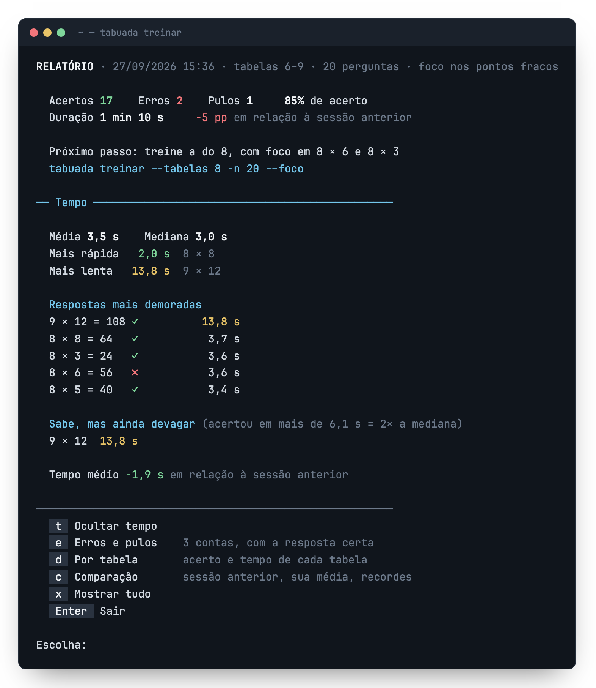

**`e` Erros e pulos**

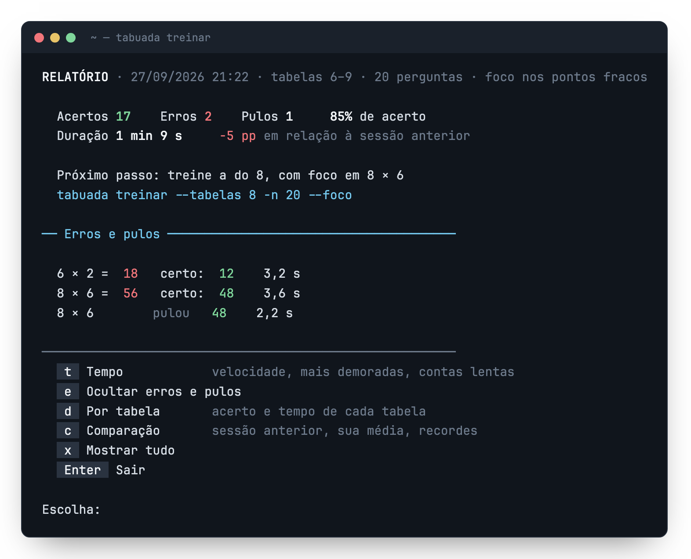

**`d` Por tabela**

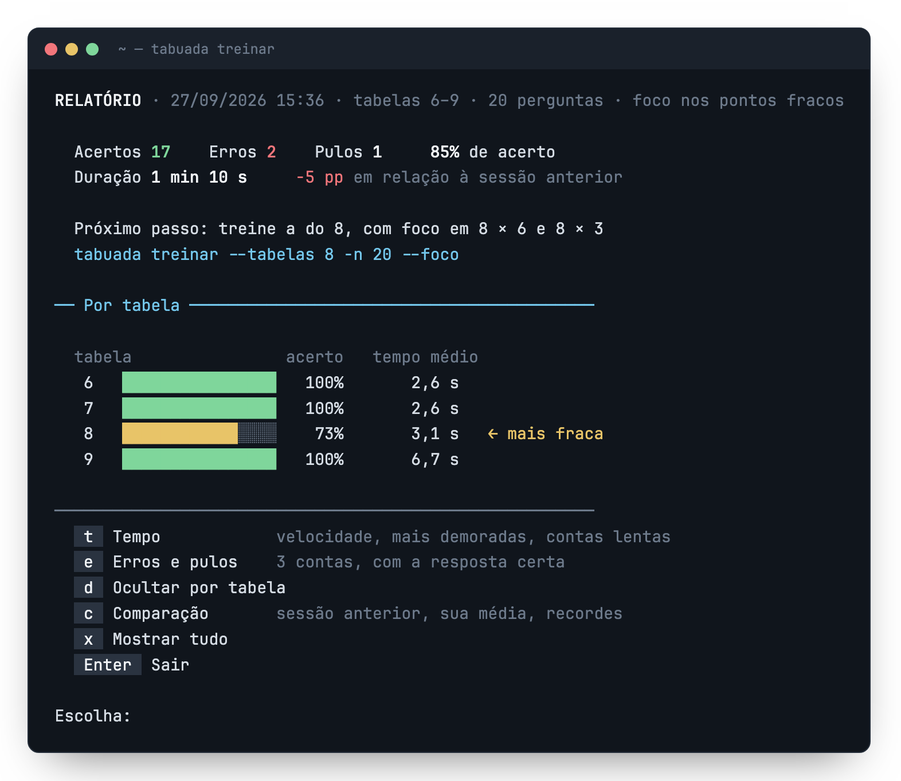

**`c` Comparação**

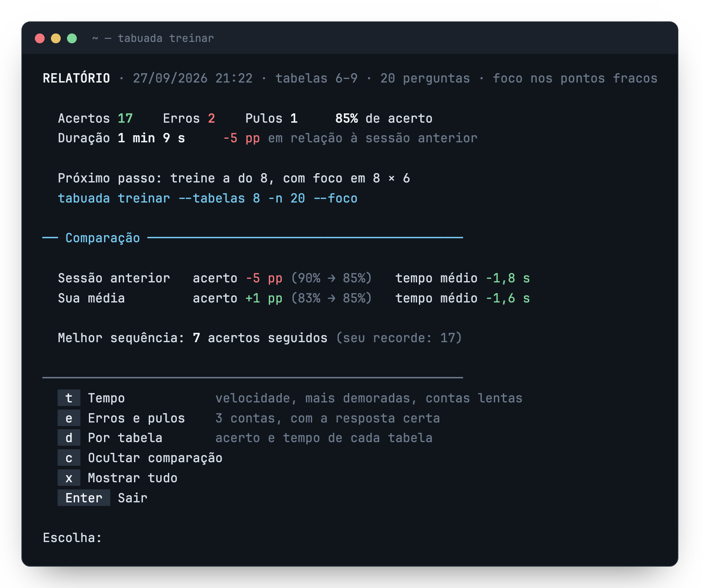

</details>

Pela linha de comando, o relatório abre direto no grupo que você quiser:

```sh
tabuada relatorio                      # última sessão
tabuada relatorio --tempo              # já com o grupo de tempo aberto
tabuada relatorio --erros              # ... erros e pulos
tabuada relatorio --tabelas            # ... por tabela
tabuada relatorio --comparacao         # ... comparação
tabuada relatorio --completo           # tudo
tabuada relatorio --sessao 11          # uma sessão antiga, pelo número
```

## Histórico, estatísticas e pontos fracos

### Histórico — menu 3 ou `tabuada historico`

Uma linha por sessão, da mais recente para a mais antiga, com acerto e tempo médio. No rodapé, quantos dias seguidos você está treinando. Pelo menu, digite o número da sessão para abrir o relatório dela.

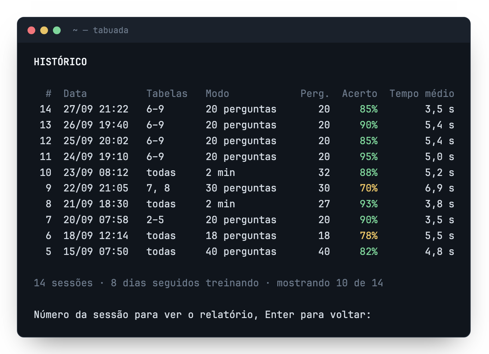

Mostra as 10 últimas; `tabuada historico --todas` lista todas.

### Estatísticas — menu 4 ou `tabuada stats`

A grade 12×12 mostra de relance onde estão os buracos: cada quadrado é uma conta, colorido pelo **domínio**, que junta acerto e tempo: como você costuma responder nas últimas 3 vezes (até 2 s, 2 a 4 s, mais de 4 s ou errando). `7 × 8` e `8 × 7` contam como a mesma conta, por isso a grade é simétrica. Embaixo, a evolução do acerto e do tempo nas últimas sessões, a melhor e a pior tabela e há quantos dias você treina seguido.

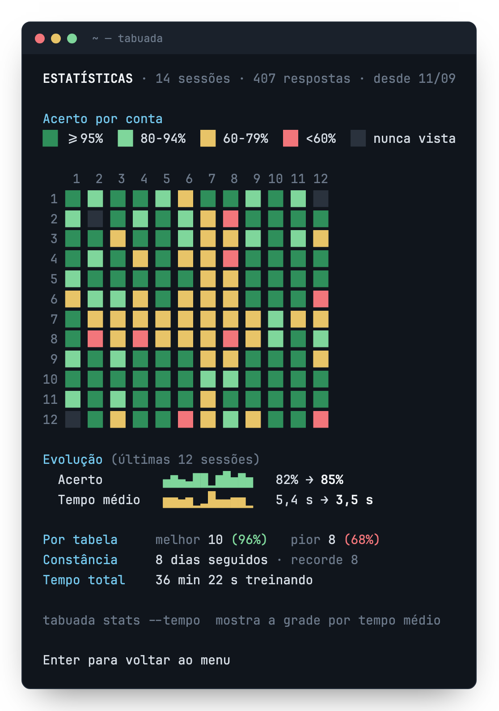

`tabuada stats --tempo` colore a grade só pelo tempo médio.

### Pontos fracos — menu 5 ou `tabuada fracos`

As contas que ainda não são automáticas, da pior para a melhor. O *Motivo* diz se você **erra**, **pensa** (acerta em mais de 4 s) ou **hesita** (2 a 4 s), e a *Revisão* diz quando a repetição espaçada vai trazer a conta de volta. Termina com o comando que treina as contas com revisão vencida.

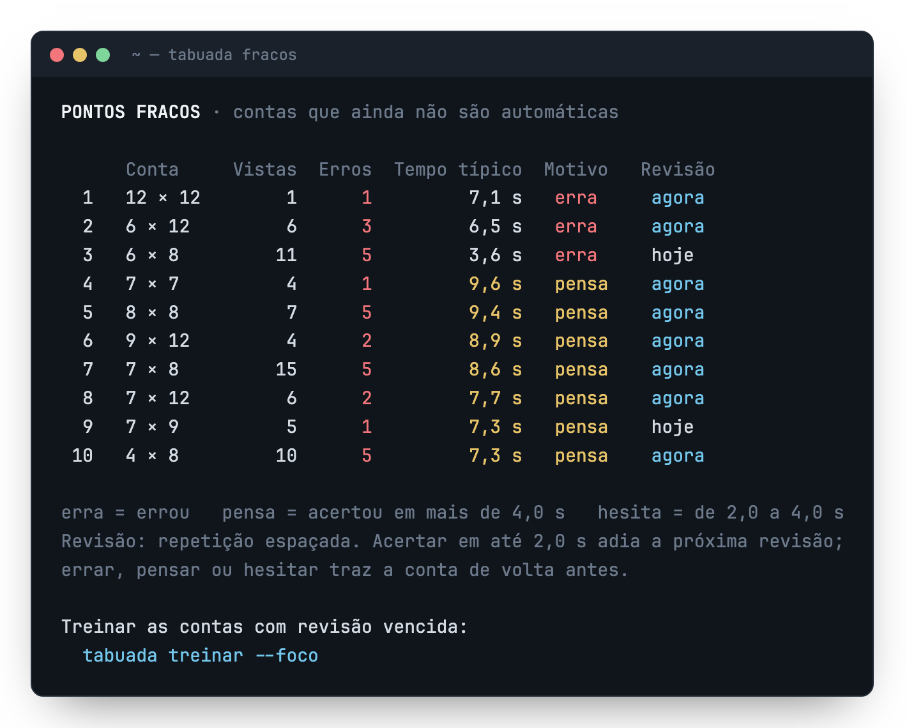

`tabuada fracos -n 20` mostra mais contas.

## Como o tabuada decide o que repetir

Cada resposta recebe uma nota pelo acerto **e** pelo tempo:

| Nota | Quando |
|---|---|
| automática | acertou em até 2 s: você lembrou, não calculou |
| hesitou | acertou entre 2 e 4 s |
| pensou | acertou em mais de 4 s: sabe, mas ainda calcula |
| errou | errou ou pulou |

**Na sessão**, a nota decide a repescagem: a errada volta 3 a 5 perguntas depois, a pensada volta 6 a 9 perguntas depois, a hesitada aparece menos e a automática quase não se repete.

**Entre sessões**, com `--foco`, vale a [repetição espaçada](https://pt.wikipedia.org/wiki/Repeti%C3%A7%C3%A3o_espa%C3%A7ada) (caixas de Leitner). Cada conta está numa caixa, e cada caixa tem um intervalo até a próxima revisão:

| Caixa | 0 | 1 | 2 | 3 | 4 | 5 |
|---|---|---|---|---|---|---|
| Revisar depois de | na hora | 10 min | 1 dia | 3 dias | 7 dias | 21 dias |

- Automática **com a revisão vencida**: sobe uma caixa. Rever antes da hora não sobe, então repetir a mesma conta muitas vezes no mesmo dia não adianta.
- Hesitou: fica no máximo na caixa 2. Pensou: volta para a caixa 1. Errou: volta para a 0.
- No sorteio, contas com revisão vencida aparecem bem mais (quanto mais baixa a caixa, mais), contas nunca vistas entram no meio, e contas em dia quase não aparecem.

Tudo é calculado a partir do histórico, então vale também para as sessões que você já fez.

## Comandos

Tudo o que o menu faz também tem um comando direto:

```sh
tabuada                                 # menu interativo
tabuada treinar                         # repete a última configuração
tabuada treinar -n 30 --tabelas 7,8     # 30 perguntas das tabelas 7 e 8
tabuada treinar --tabelas 2-9 --foco    # revisão espaçada: contas na hora de revisar
tabuada treinar --tempo 120             # contra-relógio de 2 minutos
tabuada treinar --min 6 --max 9         # segundo fator só de 6 a 9
tabuada treinar --sem-historico         # treino que não fica salvo
tabuada relatorio                       # relatório da última sessão
tabuada historico                       # sessões anteriores
tabuada stats                           # grade 12×12 e evolução
tabuada fracos                          # contas com mais erros ou mais lentas
tabuada reset                           # apaga o histórico (pede confirmação)
```

Cada comando tem a própria ajuda, por exemplo `tabuada treinar --help`:

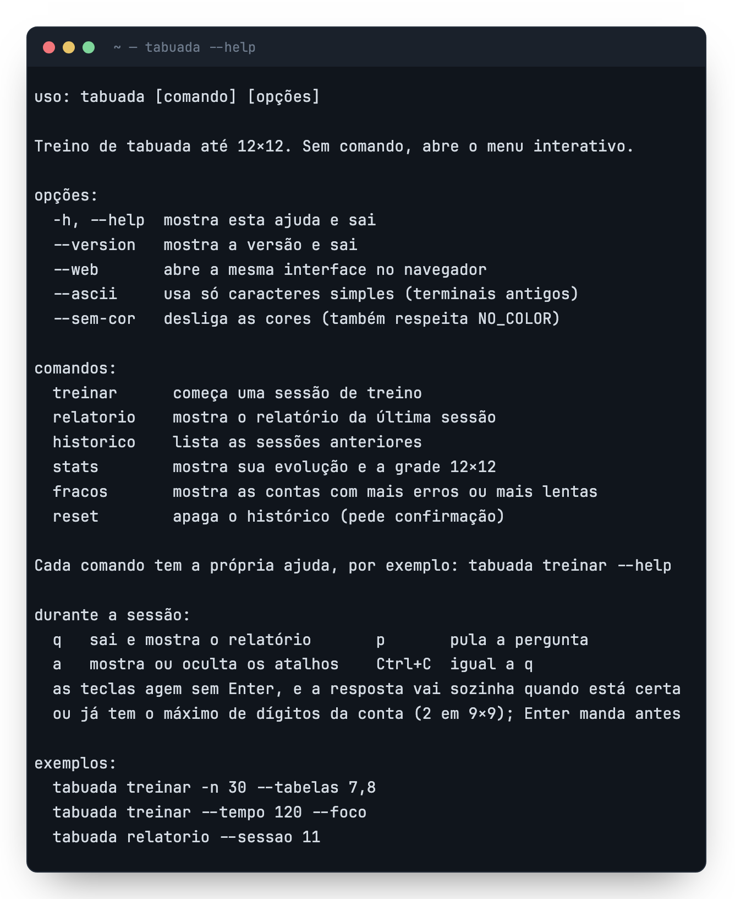

## No navegador

```sh
tabuada --web
```

Abre as mesmas telas no navegador, com clique além do teclado. Útil para quem não se sente à vontade no terminal ou quer treinar numa tela maior.

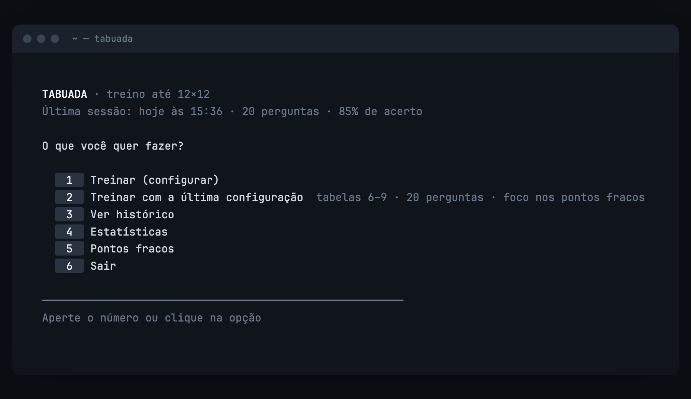

- O servidor roda só no seu computador (`127.0.0.1`), numa porta livre, e não fica acessível pela rede.
- A fonte (JetBrains Mono) e os ícones vêm dentro do pacote: nada é baixado da internet, e a aparência é a mesma em qualquer sistema.
- O histórico é o mesmo do terminal.
- Para encerrar, aperte Ctrl+C no terminal onde rodou o comando.

## Aparência no terminal

No terminal, a fonte é a que você configurou nele. As cores funcionam nos terminais modernos, inclusive no Windows 10 e 11.

- `--ascii` troca os símbolos (`✓ ✗ █ ─`) por caracteres simples, para terminais antigos. Ele liga sozinho quando o terminal não aceita UTF-8.
- `--sem-cor` desliga as cores. A variável de ambiente [`NO_COLOR`](https://no-color.org) faz o mesmo, e as cores também saem quando a saída vai para um arquivo.

Cada tela (menu, pergunta, relatório) substitui a anterior, sem encher o terminal de texto. Ao sair, o terminal volta como estava.

## Onde ficam os dados

O histórico (`history.json`) e as preferências (`config.json`) ficam na pasta `.tabuada` dentro da sua pasta de usuário:

| Sistema | Pasta |
|---|---|
| macOS | `/Users/<você>/.tabuada` |
| Linux | `/home/<você>/.tabuada` |
| Windows | `C:\Users\<você>\.tabuada` |

Para usar outra pasta, defina a variável `TABUADA_HOME`:

```sh
TABUADA_HOME=~/tabuada-da-ana tabuada          # macOS e Linux
```

```powershell
$env:TABUADA_HOME = "$HOME\tabuada-da-ana"; tabuada   # Windows (PowerShell)
```

Isso também serve para mais de uma pessoa treinar no mesmo computador, cada uma com o seu histórico. Nada é enviado para a internet.

## Atualizar e desinstalar

```sh
pipx install --force https://github.com/weslleycabral/tabuada/archive/refs/heads/main.zip   # atualizar
pipx uninstall tabuada                                                                     # desinstalar
```

Desinstalar não apaga o histórico. Para apagar, rode `tabuada reset` antes, ou apague a pasta `.tabuada`.

## Problemas comuns

**`tabuada: command not found` / "tabuada não é reconhecido"**
Rode `pipx ensurepath` e abra um terminal novo. Se ainda não funcionar, `pipx list` (ou `py -m pipx list` no Windows) mostra a pasta onde o comando foi instalado; ela precisa estar no PATH.

**No Windows, aparecem códigos como `←[36m` em vez de cores**
O terminal é muito antigo. Use o Windows Terminal ou rode com `--sem-cor`.

**Aparecem `?` ou quadradinhos no lugar de `✓ ✗ █`**
A fonte ou o terminal não tem esses símbolos. Use `--ascii`.

**No macOS, o pacote aparece como `UNKNOWN`**
É o `pip` antigo do Python da Apple. Instale com pipx pelo Homebrew, como em [macOS](#macos).

## Desenvolvimento

```sh
git clone https://github.com/weslleycabral/tabuada
cd tabuada
python3 -m tabuada                       # roda do código
python3 -m unittest discover -s tests    # testes
TABUADA_HOME=/tmp/x python3 -m tabuada   # testa sem mexer no seu histórico
```

Para usar o comando `tabuada` direto do código, sem instalar:

```sh
ln -s "$PWD/bin/tabuada" ~/.local/bin/tabuada
```

As regras de arquitetura e de interface estão em [`CLAUDE.md`](CLAUDE.md).

## Autor

Feito por **Weslley Cabral** · [LinkedIn](https://www.linkedin.com/in/weslley-cabral-857217143/) · [GitHub](https://github.com/weslleycabral)

Sugestões e bugs: abra uma [issue](https://github.com/weslleycabral/tabuada/issues).

## Licença

MIT. A fonte JetBrains Mono (`tabuada/web/fonts/`) é distribuída sob a SIL Open Font License, em `tabuada/web/fonts/OFL.txt`.
